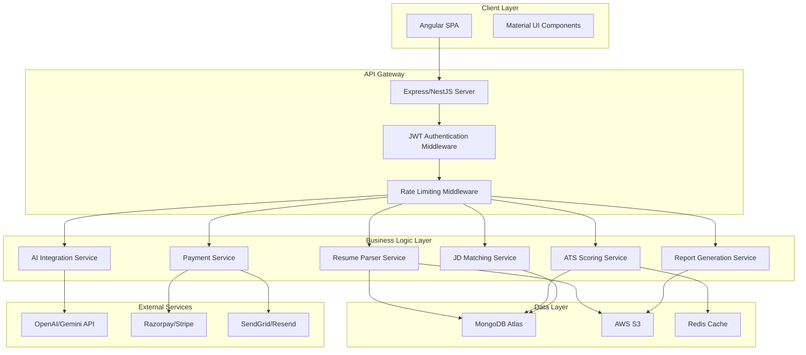
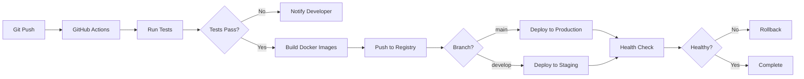

# Design Document

## Overview

The Resume Analyzer is a full-stack web application built with Angular frontend and Node.js backend, leveraging AI services for intelligent resume analysis. The system follows a microservices-inspired architecture with clear separation between presentation, business logic, and data layers. The platform supports multiple user tiers with different access levels and integrates payment processing for monetization.

## Architecture

### High-Level Architecture



### Technology Stack

**Frontend:**
- Framework: Angular 17+ with standalone components
- UI Library: Angular Material
- State Management: RxJS + Angular Services
- HTTP Client: Angular HttpClient with interceptors
- Form Handling: Reactive Forms with custom validators

**Backend:**
- Runtime: Node.js 20+
- Framework: NestJS (preferred for structure) or Express
- Language: TypeScript
- API Style: RESTful with JSON responses
- Authentication: JWT with refresh token rotation

**Database & Storage:**
- Primary Database: MongoDB Atlas (document store for user data, analysis results)
- File Storage: AWS S3 (resume files with lifecycle policies)
- Cache: Redis (rate limiting, session data, temporary analysis results)
- Queue: BullMQ with Redis (background job processing)

**AI & External Services:**
- AI Provider: OpenAI GPT-4 or Google Gemini API
- Payment Gateway: Razorpay (India), Stripe (International)
- Email Service: SendGrid or Resend API
- Monitoring: Grafana + Prometheus

**DevOps:**
- Hosting: Render or AWS Lightsail
- Containerization: Docker
- CI/CD: GitHub Actions
- SSL: Certbot with auto-renewal
- Reverse Proxy: Nginx

## Components and Interfaces

### Frontend Components

#### 1. Authentication Module
- `LoginComponent`: User login form with email/password
- `RegisterComponent`: New user registration with validation
- `AuthService`: Handles authentication state and token management
- `AuthGuard`: Route protection based on user role

#### 2. Resume Upload Module
- `UploadComponent`: Drag-and-drop file upload with progress indicator
- `FileValidatorService`: Validates file type, size, and format
- `UploadService`: Handles file upload to backend with retry logic

#### 3. Analysis Dashboard Module
- `DashboardComponent`: Main analysis interface showing all results
- `AtsScoreCardComponent`: Visual display of ATS score with breakdown
- `KeywordAnalysisComponent`: Keyword matching visualization
- `JdMatchComponent`: Job description comparison interface
- `RecommendationsComponent`: Actionable improvement suggestions

#### 4. AI Features Module
- `AiRewriteComponent`: Display and edit AI-generated suggestions
- `CoverLetterComponent`: Cover letter generation and editing interface
- `AiService`: Manages AI feature requests and responses

#### 5. Reports Module
- `ReportPreviewComponent`: On-screen report display
- `ReportDownloadComponent`: PDF generation and download interface
- `ReportService`: Handles report generation requests

#### 6. Payment Module
- `PricingComponent`: Display pricing plans and features
- `CheckoutComponent`: Payment form integration
- `SubscriptionComponent`: Manage active subscriptions
- `PaymentService`: Handles payment gateway integration

#### 7. Admin Module
- `AdminDashboardComponent`: Overview metrics and KPIs
- `UserManagementComponent`: User search, view, and management
- `FeatureToggleComponent`: Enable/disable features
- `AuditLogComponent`: View admin action history

### Backend Services

#### 1. Authentication Service
```typescript
interface AuthService {
  register(email: string, password: string): Promise<User>;
  login(email: string, password: string): Promise<AuthTokens>;
  refreshToken(refreshToken: string): Promise<AuthTokens>;
  logout(userId: string): Promise<void>;
  validateToken(token: string): Promise<TokenPayload>;
}
```

#### 2. Resume Parser Service
```typescript
interface ResumeParserService {
  parseFile(fileBuffer: Buffer, fileType: string): Promise<ParsedResume>;
  extractSections(text: string): Promise<ResumeSections>;
  extractContactInfo(text: string): Promise<ContactInfo>;
  uploadToS3(file: Buffer, userId: string): Promise<S3Location>;
  scheduleFileDeletion(s3Key: string, deleteAfterHours: number): Promise<void>;
}
```

#### 3. ATS Scoring Service
```typescript
interface ATSScoringService {
  calculateScore(resume: ParsedResume): Promise<ATSScore>;
  analyzeStructure(resume: ParsedResume): Promise<StructureScore>;
  analyzeKeywords(resume: ParsedResume): Promise<KeywordScore>;
  analyzeReadability(text: string): Promise<ReadabilityScore>;
  analyzeFormatting(resume: ParsedResume): Promise<FormattingScore>;
  generateRecommendations(score: ATSScore): Promise<Recommendation[]>;
}
```

#### 4. JD Matching Service
```typescript
interface JDMatchingService {
  compareResumeToJD(resume: ParsedResume, jobDescription: string): Promise<MatchResult>;
  extractJDRequirements(jobDescription: string): Promise<JobRequirements>;
  calculateMatchPercentage(resume: ParsedResume, requirements: JobRequirements): Promise<number>;
  identifyMissingKeywords(resume: ParsedResume, requirements: JobRequirements): Promise<string[]>;
  identifyMatchedKeywords(resume: ParsedResume, requirements: JobRequirements): Promise<KeywordMatch[]>;
}
```

#### 5. AI Integration Service
```typescript
interface AIService {
  rewriteBulletPoints(bulletPoints: string[]): Promise<RewriteSuggestion[]>;
  rewriteSummary(summary: string): Promise<string[]>;
  generateCoverLetter(resume: ParsedResume, jobDescription: string): Promise<string>;
  improveSection(sectionText: string, sectionType: string): Promise<string[]>;
}
```

#### 6. Report Generation Service
```typescript
interface ReportService {
  generatePDFReport(analysisData: AnalysisResult, userTier: UserTier): Promise<Buffer>;
  generateOnScreenReport(analysisData: AnalysisResult): Promise<ReportData>;
  applyWatermark(pdfBuffer: Buffer): Promise<Buffer>;
  uploadReportToS3(pdfBuffer: Buffer, userId: string): Promise<string>;
  generateDownloadLink(s3Key: string, expiryDays: number): Promise<string>;
}
```

#### 7. Payment Service
```typescript
interface PaymentService {
  createPaymentIntent(userId: string, planId: string): Promise<PaymentIntent>;
  processPayment(paymentId: string, paymentDetails: PaymentDetails): Promise<PaymentResult>;
  handleWebhook(provider: string, payload: any): Promise<void>;
  upgradeUserAccount(userId: string, planId: string): Promise<void>;
  processRefund(paymentId: string, reason: string): Promise<RefundResult>;
  handleSubscriptionRenewal(subscriptionId: string): Promise<void>;
}
```

#### 8. User Service
```typescript
interface UserService {
  createUser(userData: CreateUserDTO): Promise<User>;
  getUserById(userId: string): Promise<User>;
  updateUserTier(userId: string, tier: UserTier): Promise<User>;
  checkUsageLimit(userId: string): Promise<UsageLimitStatus>;
  incrementUsageCount(userId: string): Promise<void>;
  resetDailyUsage(): Promise<void>;
}
```

#### 9. Admin Service
```typescript
interface AdminService {
  getDashboardMetrics(): Promise<DashboardMetrics>;
  searchUsers(query: string, filters: UserFilters): Promise<User[]>;
  manuallyUpgradeUser(userId: string, tier: UserTier, adminId: string): Promise<void>;
  toggleFeature(featureName: string, enabled: boolean, adminId: string): Promise<void>;
  getAuditLogs(filters: AuditFilters): Promise<AuditLog[]>;
  getSystemHealth(): Promise<SystemHealth>;
}
```

## Data Models

### User Model
```typescript
interface User {
  _id: ObjectId;
  email: string;
  passwordHash: string;
  firstName?: string;
  lastName?: string;
  userTier: 'anonymous' | 'free' | 'premium' | 'admin';
  subscriptionId?: string;
  subscriptionStatus?: 'active' | 'cancelled' | 'expired';
  subscriptionExpiresAt?: Date;
  usageCount: number;
  dailyUsageResetAt: Date;
  createdAt: Date;
  updatedAt: Date;
  lastLoginAt?: Date;
}
```

### Analysis Result Model
```typescript
interface AnalysisResult {
  _id: ObjectId;
  userId: ObjectId;
  resumeS3Key: string;
  atsScore: ATSScore;
  jdMatchResult?: MatchResult;
  aiSuggestions?: RewriteSuggestion[];
  coverLetter?: string;
  reportS3Key?: string;
  reportDownloadUrl?: string;
  reportExpiresAt?: Date;
  createdAt: Date;
}
```

### ATS Score Model
```typescript
interface ATSScore {
  totalScore: number; // 0-100
  structureScore: number; // 0-25
  keywordScore: number; // 0-30
  readabilityScore: number; // 0-25
  formattingScore: number; // 0-20
  breakdown: ScoreBreakdown;
  recommendations: Recommendation[];
}
```

### Payment Model
```typescript
interface Payment {
  _id: ObjectId;
  userId: ObjectId;
  provider: 'razorpay' | 'stripe';
  providerPaymentId: string;
  amount: number;
  currency: string;
  planId: string;
  status: 'pending' | 'completed' | 'failed' | 'refunded';
  refundReason?: string;
  refundedAt?: Date;
  createdAt: Date;
  updatedAt: Date;
}
```

### Audit Log Model
```typescript
interface AuditLog {
  _id: ObjectId;
  adminId: ObjectId;
  action: string;
  targetUserId?: ObjectId;
  details: Record<string, any>;
  ipAddress: string;
  timestamp: Date;
}
```

## Error Handling

### Error Categories

1. **Validation Errors (400)**
   - Invalid file format
   - File size exceeds limit
   - Missing required fields
   - Invalid email format

2. **Authentication Errors (401)**
   - Invalid credentials
   - Expired token
   - Missing authentication token

3. **Authorization Errors (403)**
   - Insufficient permissions
   - Feature not available for user tier
   - Usage limit exceeded

4. **Not Found Errors (404)**
   - User not found
   - Analysis result not found
   - Report not found

5. **Rate Limiting Errors (429)**
   - Too many requests
   - API quota exceeded

6. **External Service Errors (502/503)**
   - AI API unavailable
   - Payment gateway timeout
   - S3 upload failed

7. **Internal Server Errors (500)**
   - Database connection failed
   - Unexpected processing error

### Error Response Format
```typescript
interface ErrorResponse {
  success: false;
  error: {
    code: string;
    message: string;
    details?: any;
    timestamp: string;
  };
}
```

### Retry Strategy
- File uploads: 3 retries with exponential backoff
- AI API calls: 2 retries with 5-second delay
- Payment processing: No automatic retry (user-initiated)
- Report generation: 3 retries before failure notification

### Fallback Mechanisms
- If AI service fails: Queue request for later processing, notify user
- If S3 upload fails: Store temporarily in database, retry upload
- If payment webhook fails: Manual reconciliation via admin dashboard
- If email sending fails: Queue for retry, log for manual follow-up

## Testing Strategy

### Unit Testing
- **Target Coverage:** 80% minimum
- **Framework:** Jest for both frontend and backend
- **Focus Areas:**
  - Service layer business logic
  - Utility functions (scoring algorithms, parsers)
  - Validators and transformers
  - Component logic (Angular)

### Integration Testing
- **Framework:** Jest + Supertest (backend), Cypress Component Testing (frontend)
- **Focus Areas:**
  - API endpoint workflows
  - Database operations
  - External service integrations (mocked)
  - Authentication flows

### End-to-End Testing
- **Framework:** Cypress
- **Critical User Flows:**
  - Complete resume analysis flow (upload → score → report)
  - User registration and login
  - Payment and subscription upgrade
  - JD matching workflow
  - AI rewrite feature
  - Admin user management

### Performance Testing
- **Tool:** Artillery or k6
- **Scenarios:**
  - 100 concurrent users uploading resumes
  - Sustained load of 50 requests/second
  - AI API response time under load
  - Database query performance with 10,000+ users

### Security Testing
- **Areas:**
  - SQL/NoSQL injection attempts
  - XSS vulnerability scanning
  - CSRF protection validation
  - JWT token manipulation attempts
  - File upload security (malicious files)
  - Rate limiting effectiveness

### Manual Testing
- **Focus:**
  - UI/UX validation
  - Cross-browser compatibility (Chrome, Firefox, Safari, Edge)
  - Mobile responsiveness
  - Payment gateway integration
  - Email delivery and formatting
  - PDF report quality and formatting

## Deployment Architecture

### Environment Setup
- **Development:** Local Docker containers
- **Staging:** Render preview environment
- **Production:** Render or AWS Lightsail with auto-scaling

### CI/CD Pipeline


### Monitoring and Alerts
- **Metrics to Track:**
  - API response times (p50, p95, p99)
  - Error rates by endpoint
  - AI API costs and usage
  - Database query performance
  - S3 storage usage
  - Active user sessions
  - Payment success/failure rates

- **Alert Triggers:**
  - Response time > 2 seconds for 5 minutes
  - Error rate > 5% for 10 minutes
  - AI API cost spike > 50% of daily budget
  - Payment failure rate > 10%
  - Disk usage > 80%
  - Memory usage > 85%

### Backup and Recovery
- **Database:** Daily automated backups to S3, 30-day retention
- **User Files:** S3 versioning enabled, lifecycle policy for deletion
- **Configuration:** Version controlled in Git
- **Recovery Time Objective (RTO):** 4 hours
- **Recovery Point Objective (RPO):** 24 hours

## Security Considerations

### Authentication & Authorization
- JWT tokens with 24-hour expiry
- Refresh tokens with 30-day expiry, stored in httpOnly cookies
- Password requirements: minimum 8 characters, 1 uppercase, 1 number, 1 special character
- Bcrypt hashing with salt rounds = 12
- Role-based access control (RBAC) for admin features

### Data Protection
- All API communications over HTTPS (TLS 1.3)
- S3 buckets private with signed URLs (1-hour expiry)
- Database connections encrypted
- Sensitive data encrypted at rest
- PII data minimization (only store necessary information)

### Input Validation
- File type validation (whitelist: PDF, DOCX)
- File size limits enforced (5MB max)
- Content-Type verification
- Malware scanning for uploaded files
- SQL/NoSQL injection prevention via parameterized queries
- XSS prevention via input sanitization and CSP headers

### Rate Limiting
- Anonymous users: 10 requests/hour
- Free users: 50 requests/hour
- Premium users: 500 requests/hour
- Admin users: 1000 requests/hour
- IP-based rate limiting for authentication endpoints

### Compliance
- GDPR compliance: User data deletion on request
- Data retention policy: Resume files deleted after 24 hours
- Privacy policy and terms of service
- Cookie consent banner
- Audit logging for compliance tracking

